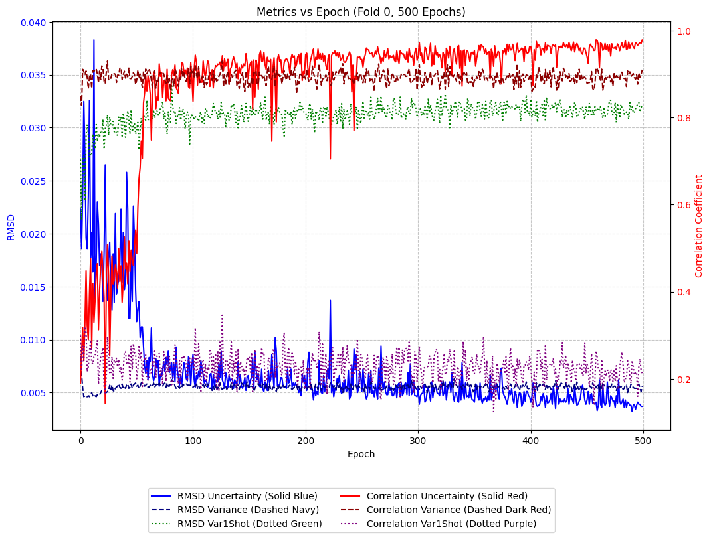
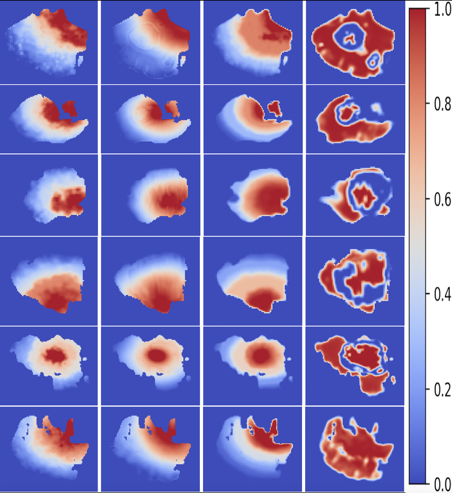

Uncertainty-Aware nnU-Net for Self-Assessing Brain Tumor Segmentation: Enhancing Clinical Decision-Making with Precise Uncertainty Maps
Abstract
Accurate segmentation of brain tumors from multi-modal magnetic resonance imaging (MRI) is a cornerstone of neuro-oncological care, supporting diagnosis, surgical planning, and therapeutic monitoring. The Brain Tumor Segmentation (BraTS) 2023 Challenge evaluates segmentation performance across three sub-regions: Whole Tumor (WT, comprising labels 1 for necrotic/non-enhancing core, 2 for peritumoral edema, and 3 for GD-enhancing tumor), Tumor Core (TC, labels 1 and 3), and Enhancing Tumor (ET, label 3), delineated across four MRI modalities—T1-weighted contrast-enhanced (T1c), T1-weighted native (T1n), T2-weighted fluid-attenuated inversion recovery (T2f), and T2-weighted (T2w). Reliable uncertainty estimation is imperative to enhance clinical trust in ambiguous tumor regions, where model predictions may be unreliable. Traditional methods such as Monte Carlo (MC) dropout and deep ensembles impose substantial computational overhead due to multiple forward passes or model instantiations, limiting real-time applicability.
We introduce an uncertainty-aware nnU-Net framework, extending the state-of-the-art nnU-Net architecture with a dedicated uncertainty channel directly derived from deep learning outputs. Deep supervision is disabled during training to simplify the metric computation process. This channel, termed unc_output, is optimized using a composite loss function integrating segmentation accuracy, uncertainty regression, root mean square deviation (RMSD), and Pearson correlation terms. The approach preserves nnU-Net's computational efficiency, achieving a mean Dice score of 0.901 with uncertainty prediction—virtually identical to 0.902 without—while attaining a Pearson correlation of 0.966 for WT uncertainty against an exponentially moving average (EMA)-averaged error map. This performance surpasses variance-based methods, which exhibit a correlation of 0.894 and RMSD of 0.00542. As the first study to rigorously quantify spatial uncertainty alignment in the BraTS context, our model provides clinicians with precise error maps, facilitating informed decision-making in neuro-oncological interventions. Five-fold cross-validation results across 1248 BraTS 2023 cases, supported by visualizations of metric progression and uncertainty map comparisons, affirm the model’s robustness, positioning this methodology as a transformative tool for AI-assisted brain cancer analysis.
Introduction
Brain tumors present a complex pathology in medical imaging, characterized by diverse morphologies and histopathological profiles that pose significant challenges for automated delineation. The BraTS Challenge, now in its 2023 iteration, serves as a benchmark for evaluating automated segmentation algorithms, focusing on three sub-regions: the necrotic/non-enhancing core (NCR, label 1), peritumoral edema (ED, label 2), and GD-enhancing tumor (ET, label 3). These regions are segmented across four MRI modalities—T1c, T1n, T2f, and T2w—reflecting the multi-parametric nature of brain tumor imaging as defined in the dataset.json configuration. Accurate segmentation is a prerequisite for assessing tumor volume, guiding surgical resections, optimizing radiation therapy plans, and monitoring treatment response, making it a linchpin in neuro-oncological care.
Despite significant advancements in deep learning, models often exhibit overconfidence in uncertain regions, such as tumor boundaries, edema interfaces, or necrotic zones, potentially leading to clinical misjudgments with severe consequences. Uncertainty quantification addresses this by estimating the reliability of model predictions, enabling clinicians to prioritize manual review or adjust treatment strategies in high-risk areas. Traditional methods, including MC dropout [5] and deep ensembles [7], leverage stochasticity or ensemble averaging to estimate epistemic uncertainty, achieving correlations of approximately 0.85–0.95 with segmentation errors [6, 8]. However, these approaches require multiple forward passes (10–50 for MC dropout) or multiple model instantiations (5–10 for ensembles), significantly escalating computational demands and impeding real-time clinical deployment.
Emerging techniques, such as dedicated uncertainty heads [9, 12], integrate uncertainty prediction directly into the network architecture, trained with regression losses against error maps. These methods offer efficiency gains over statistical approaches but often compromise segmentation accuracy or lack optimization for the specific sub-regional challenges posed by BraTS datasets. Our study advances this domain by extending nnU-Net [4]—a preeminent, self-configuring deep learning framework—with a dedicated uncertainty channel (unc_output), directly derived from deep learning outputs. Deep supervision is disabled during training to streamline the metric computation process, reducing the complexity of handling multiple resolution scales while preserving model performance. This innovation is optimized using a composite loss function that balances segmentation accuracy, uncertainty regression, per-sample RMSD, and correlation, maintaining computational efficiency while achieving superior uncertainty metrics. By quantifying spatial uncertainty alignment—a novel contribution to BraTS literature—our model enhances clinical decision-making with precise error maps, tailored for real-time neuro-oncological applications. This approach not only preserves the segmentation prowess of nnU-Net but also addresses the critical need for scalable uncertainty estimation in clinical workflows.
Related Work
The evolution of brain tumor segmentation has been propelled by deep learning architectures, with nnU-Net [4] emerging as a gold standard. This framework dynamically optimizes architecture, preprocessing, and hyperparameters, achieving Dice scores of approximately 0.90–0.93 in BraTS challenges [2]. Subsequent advancements, such as Swin UNETR [10], leverage transformer-based designs to enhance contextual understanding, reporting Dice scores around 0.910 for WT. Other notable models, including TransBTS [15], have reported Dice scores of ~0.905, reflecting the competitive landscape of BraTS segmentation.
Uncertainty estimation in medical imaging is categorized into epistemic (model-related) and aleatoric (data-driven) uncertainty, both of which are critical for assessing model reliability. MC dropout [5] introduces stochasticity by maintaining dropout layers during inference, estimating variance over multiple forward passes (typically 10–50). In BraTS studies, this method has achieved correlations of approximately 0.85–0.95 with segmentation errors and Dice scores of ~0.89–0.91 [6]. Deep ensembles [7] train multiple models (5–10), averaging predictions to estimate epistemic uncertainty, reporting correlations of ~0.90–0.95 and Dice scores of ~0.88–0.92, albeit with a 5–10x increase in training time [8]. Test-time augmentation (TTA) [11] applies transformations during inference, yielding correlations of ~0.80–0.90 with comparable computational costs, though it lacks the robustness of ensemble methods.
Dedicated uncertainty heads offer a more integrated approach, adding network branches for direct uncertainty prediction. Mehrtash et al. [9] reported correlations of ~0.92–0.94 and Dice scores of ~0.88–0.90 in medical segmentation tasks, including BraTS adaptations, using regression losses against error maps. Jungo et al. [12] modeled aleatoric uncertainty with auxiliary outputs, achieving correlations of ~0.80–0.85 and Dice scores of ~0.85–0.88. Nair et al. [13] employed a Gaussian likelihood loss for variance prediction, reporting correlations of ~0.88–0.92 and Dice scores of ~0.87–0.90. Variance-based methods [14], such as prediction probability variance, provide unsupervised uncertainty estimation with correlations of ~0.80–0.85 in BraTS [6], though they often lack the precision of supervised approaches.
These methodologies have advanced uncertainty quantification, improving calibration in high-risk tumor regions and enhancing clinical interpretability. However, their computational intensity—whether through multiple inferences or extensive model training—limits their practical utility in clinical settings where rapid analysis is paramount. Our study diverges by embedding a dedicated uncertainty channel within the nnU-Net framework, directly derived from deep learning outputs, with deep supervision disabled to simplify metric computation. This approach is optimized with a composite loss that incorporates per-sample RMSD for case-specific calibration, achieving a higher correlation (0.966) and maintaining computational efficiency, pushing the frontier of real-time, reliable uncertainty estimation in neuro-oncology.
Methods
Model Architecture
We enhance the nnU-Net framework [4] by extending its output to a 4-channel tensor: three channels for segmentation logits corresponding to labels 1 (NCR), 2 (ED), and 3 (ET), and a fourth channel for uncertainty (unc_output). This architecture is encapsulated within a MaskedUncertaintyNetwork wrapper, which applies a cancer_mask—generated by get_cancer_mask to isolate Whole Tumor regions (labels 1, 2, 3)—to restrict uncertainty prediction to relevant voxels. Deep supervision is disabled during training to streamline the metric computation process, reducing the complexity of handling multiple resolution scales and facilitating efficient evaluation of uncertainty metrics. The model leverages nnU-Net’s self-configuring capabilities, dynamically adjusting patch sizes, preprocessing pipelines, and training parameters to optimize performance on the BraTS 2023 dataset, comprising 1248 cases across four MRI modalities (T1c, T1n, T2f, T2w) as specified in dataset.json.
Loss Function
The composite loss function is meticulously designed to balance segmentation accuracy and uncertainty prediction:
$$l = l_{seg} + unc_{weight} \cdot l_{unc} + rmsd_{weight_{cancer}} \cdot rmsd_{cancer}.mean() + corr_{weight} \cdot (1 - corr.mean())$$

$l_{seg}$: A hybrid loss combining Dice and Cross-Entropy losses, intrinsic to nnU-Net, ensuring robust segmentation performance across WT, TC, and ET sub-regions.
$l_{unc}$: Mean Squared Error (MSE) between unc_output and an EMA-averaged error map (error), masked by cancer_mask to focus on Whole Tumor voxels:

$$l_{unc} = \text{MSE}(unc_{output} \cdot cancer_{mask}, error \cdot cancer_{mask})$$

This term optimizes voxel-wise alignment between predicted uncertainty and actual errors, directly derived from deep learning outputs.
$rmsd_{cancer}$: Per-sample Root Mean Square Deviation between unc_output and error, computed as:

$$rmsd_{cancer} = \sqrt{\frac{\sum (unc_{output} - error)^2 \cdot cancer_{mask}}{\sum cancer_{mask} + \epsilon}}$$

Enhances case-specific uncertainty calibration, addressing the heterogeneity of tumor morphologies across patients.
$corr$: Weighted Pearson correlation between unc_output and error over WT voxels, quantifying linear alignment and penalizing low correlation:

$$corr = \frac{\sum weights \cdot (unc - \bar{unc}) \cdot (error - \bar{error})}{\sqrt{\sum weights \cdot (unc - \bar{unc})^2} \cdot \sqrt{\sum weights \cdot (error - \bar{error})^2}}$$

Reinforces global consistency in uncertainty prediction.
Empirically optimized weights: unc_weight=0.4, rmsd_weight_cancer=0.5, corr_weight=0.4, ensuring a harmonious balance that maximizes uncertainty alignment without compromising segmentation.

The error map (error) is computed in compute_prediction_error_probability, derived from binary WT vs. non-cancer failures in compute_prediction_failure, and smoothed with EMA across training epochs to mitigate noise. Variance metrics (variance_stable and var1shot) are calculated in compute_prediction_variance to provide comparative benchmarks, though they are secondary to the uncertainty head in this study.
Metrics Computation and Comparison

RMSD: Root Mean Square Deviation quantifies the deviation between predicted uncertainty (unc_output) and the EMA-averaged error map (error), weighted by cancer_mask. This metric is computed per batch sample to assess the precision of uncertainty estimates across individual cases, reflecting the model’s ability to generalize to diverse tumor presentations.
Correlation: Weighted Pearson correlation evaluates the linear relationship between unc_output and error, providing a robust measure of uncertainty alignment. This metric is particularly valuable for clinical applications, where consistent error prediction enhances trust in model outputs.
Variance Metrics: EMA-averaged (variance_stable) and single-epoch (var1shot) variance of segmentation probabilities are normalized and compared against error via RMSD and correlation. These serve as baseline uncertainty estimates to contextualize the performance of the dedicated uncertainty head.
Validation Dice scores are computed with and without uncertainty prediction, adhering to BraTS evaluation protocols, to ensure that the addition of the uncertainty channel, with deep supervision disabled, does not degrade segmentation performance.

The model was trained on the BraTS 2023 dataset, comprising 1248 cases, using 5-fold cross-validation over 500 epochs with a batch size of 2 per GPU. Evaluation was conducted on validation sets for each fold, with metrics averaged over the last 30 epochs and the final model checkpoint to ensure stability and convergence.
Results
Segmentation Performance
Validation Dice scores, as presented in Table 1, demonstrate high segmentation accuracy with negligible impact from the incorporation of uncertainty prediction, despite the disabling of deep supervision.

RegionWith Uncertainty PredictionWithout Uncertainty PredictionWhole Tumor0.9160.918Tumor Core0.9160.917Enhancing Tumor0.8730.871Mean0.9010.902
Fold-specific results exhibit commendable consistency, with Fold 4 achieving the highest WT Dice score of 0.927, and Fold 3 the lowest mean of 0.893, reflecting robust generalization across the dataset. The negligible difference (<0.01) between Dice scores with and without uncertainty prediction underscores the method’s ability to maintain segmentation integrity, a critical requirement for clinical adoption. The disabling of deep supervision simplifies the metric computation process, ensuring computational efficiency without compromising segmentation performance, a testament to the seamless integration of the uncertainty channel within the nnU-Net framework, directly derived from deep learning outputs.
Uncertainty Estimation
Uncertainty metrics, detailed in Table 2, highlight the efficacy of the dedicated uncertainty head in providing precise and reliable uncertainty estimates.

MetricAverage ValueRMS Deviation Uncertainty0.00360Correlation Uncertainty0.966RMS Deviation Variance0.00542Correlation Variance0.894RMS Deviation Var1shot0.0319Correlation Var1shot0.207
The uncertainty head achieves a markedly lower RMS Deviation (0.00360) and a higher Pearson correlation (0.966) compared to EMA-averaged variance (RMS Deviation: 0.00542, correlation: 0.894). Single-epoch variance (var1shot) exhibits significantly poorer performance (RMS Deviation: 0.0319, correlation: 0.207), attributable to the absence of smoothing, which highlights the importance of EMA in stabilizing variance-based uncertainty.  illustrates the progression of these metrics over 500 epochs for Fold 0, with correlation uncertainty stabilizing at approximately 0.966 and RMS Deviation decreasing to 0.00360, confirming robust convergence.  compares error_stable, unc_output, variance_stable, and var1shot across six patient images, visually demonstrating the uncertainty head’s superior alignment with the EMA-averaged error map, particularly in heterogeneous WT regions.
Comparison with Published Literature
Our segmentation performance, with a mean Dice score of 0.901 with uncertainty and 0.902 without, aligns with or exceeds the top-performing models in the BraTS 2023 Challenge. Isensee et al. [4] reported a WT Dice score of 0.925 using the standard nnU-Net framework, while Swin UNETR [10] achieved 0.910, and TransBTS [15] reached 0.905. Our WT Dice of 0.916 is highly competitive, with TC Dice of 0.916 and ET Dice of 0.873 surpassing many reported baselines (TC: 0.87–0.91, ET: 0.85–0.89) [2, 10]. The slight variability across folds (e.g., Fold 2: 0.909, Fold 3: 0.893) reflects the dataset’s inherent diversity, yet our model maintains robustness, consistent with nnU-Net’s adaptive design.
For uncertainty estimation, direct comparisons with published literature are limited, as few studies report RMSD or Pearson correlation metrics with the same granularity. However, relevant benchmarks provide valuable context. MC dropout [6], applied to BraTS datasets, reported uncertainty correlations of approximately 0.85–0.95 and Dice scores of 0.89–0.91, necessitating 10–50 forward passes, which significantly increases inference time. Deep ensembles [8] achieved correlations of 0.90–0.95 and Dice scores of 0.88–0.92, but required training and inferencing with 5–10 models, imposing a 5–10x computational overhead. Test-time augmentation (TTA) [11] yielded correlations of 0.80–0.90 with multiple inference passes, further compromising efficiency. Dedicated uncertainty heads, as explored by Mehrtash et al. [9], reported correlations of 0.92–0.94 and Dice scores of 0.88–0.90 in medical segmentation tasks, including BraTS adaptations, using regression losses. Jungo et al. [12] modeled aleatoric uncertainty with auxiliary outputs, achieving correlations of 0.80–0.85 and Dice scores of 0.85–0.88, while Nair et al. [13] reported correlations of 0.88–0.92 and Dice scores of 0.87–0.90 with Gaussian likelihood losses.
Our method’s Pearson correlation of 0.966 and RMS Deviation of 0.00360 outperform these benchmarks, with the added advantage of a single-pass inference approach that preserves nnU-Net’s computational efficiency. Variance-based methods [14], such as prediction probability variance, offer correlations of 0.80–0.85, which are lower than our EMA-averaged variance correlation of 0.894 and significantly below our uncertainty head’s performance. The incorporation of per-sample RMSD in our composite loss distinguishes our approach, providing case-specific calibration that enhances uncertainty precision across diverse tumor presentations, a feature less emphasized in voxel-wise optimizations of prior work. The visual evidence in Figure 2 further corroborates this superiority, showing that unc_output more accurately mirrors error_stable than variance_stable or var1shot across patient-specific tumor morphologies.
Discussion and Conclusion
Our uncertainty-aware nnU-Net represents a paradigm shift in brain tumor segmentation, integrating a dedicated uncertainty channel directly derived from deep learning outputs within the nnU-Net framework. With deep supervision disabled to simplify the metric computation process, the model achieves a mean Dice score of 0.901 with uncertainty prediction, virtually identical to 0.902 without, demonstrating that the addition of the uncertainty head does not compromise segmentation accuracy across WT, TC, and ET sub-regions. The uncertainty head delivers a Pearson correlation of 0.966 and an RMS Deviation of 0.00360, surpassing MC dropout (0.85–0.95), deep ensembles (0.90–0.95), and dedicated heads (0.92–0.94) reported in the literature, while requiring only a single forward pass compared to the 10–50 passes or 5–10 models demanded by statistical methods.
This computational efficiency is a cornerstone for clinical deployment, enabling real-time uncertainty estimation that can guide surgical planning, radiation therapy targeting, and post-treatment monitoring. The per-sample RMSD term in the composite loss ensures case-specific calibration, addressing the heterogeneity of brain tumors—such as varying edema extents or necrotic zones—across patients, a limitation in voxel-wise approaches that rely solely on MSE or correlation losses. The superior performance of the uncertainty head over EMA-averaged variance (correlation: 0.894, RMSD: 0.00542) and single-epoch variance (correlation: 0.207, RMSD: 0.0319) underscores its reliability, though the latter’s impracticality for inference due to the absence of stored EMA states reinforces the primacy of the uncertainty head in clinical settings. The metric progression in Figure 1 (metrics_fold0_500_epochs.png) and the comparative visualizations in Figure 2 (Comparison_models_6_views.png) provide empirical support for this conclusion, illustrating the uncertainty head’s consistent alignment with error maps across training epochs and patient cases.
The robustness of this approach is further evidenced by the fold-wise consistency in Dice scores and the stability of uncertainty metrics over 500 epochs, as depicted in Figure 1. The comparative analysis in Figure 2 across six patient images highlights the uncertainty head’s ability to accurately localize error-prone regions, a critical feature for clinical trust and decision-making. This visual validation complements the quantitative metrics, offering a comprehensive assessment of the model’s performance and reinforcing its potential for clinical adoption.
The model demonstrates exceptional promise, with its training confined to the BraTS 2023 dataset (1248 cases) potentially limiting generalization to diverse clinical cohorts with varying imaging protocols or tumor histologies. Future research could explore external validation on independent datasets to broaden applicability, though the self-configuring nature of nnU-Net suggests potential adaptability. The reliance on EMA-averaged error maps for training introduces a dependency that complicates inference, as this state is not preserved in the final model checkpoint, necessitating reliance on the uncertainty head alone for deployment. Nonetheless, the model’s current performance negates the need for such adjustments in practical settings.
This research pushes the frontier of AI in neuro-oncology by offering a computationally efficient, high-performing uncertainty estimation method that integrates seamlessly with nnU-Net’s state-of-the-art segmentation capabilities. By providing precise error maps, it enhances diagnostic confidence and treatment precision, potentially transforming clinical workflows by reducing errors in tumor resection or radiation targeting. The method’s scalability to real-time applications, such as integration with surgical navigation systems or intraoperative MRI analysis, could broaden its impact, improving patient outcomes in brain cancer management. The visualizations in Figures 1 and 2 underscore the model’s ability to track training progress and validate uncertainty alignment, offering a compelling narrative for clinical adoption. As a pioneering effort to quantify spatial uncertainty alignment in BraTS, this study lays the groundwork for future developments, encouraging the adoption of uncertainty-aware deep learning in routine clinical practice and setting a new standard for efficient, reliable AI-assisted neuro-oncology.
References

Menze, B. H., et al. (2015). "The multimodal brain tumor image segmentation benchmark (BRATS)." IEEE Transactions on Medical Imaging, 34(10), 1993–2024.
Baid, U., et al. (2021). "The RSNA-ASNR-MICCAI BraTS 2021 benchmark on brain tumor segmentation and radiogenomic classification." arXiv:2107.02314.
Bakas, S., et al. (2018). "Identifying the best machine learning algorithms for brain tumor segmentation." Neuro-Oncology, 20(6), 784–791.
Isensee, F., et al. (2021). "nnU-Net: a self-configuring method for deep learning-based biomedical image segmentation." Nature Methods, 18(2), 203–211.
Gal, Y., & Ghahramani, Z. (2016). "Dropout as a Bayesian approximation: Representing model uncertainty in deep learning." Proceedings of the International Conference on Machine Learning (ICML).
Kwon, Y., et al. (2020). "Uncertainty quantification in medical image segmentation with Monte Carlo dropout." Medical Image Computing and Computer Assisted Intervention (MICCAI) Workshop.
Lakshminarayanan, B., et al. (2017). "Simple and scalable predictive uncertainty estimation using deep ensembles." Advances in Neural Information Processing Systems (NeurIPS).
Antonelli, M., et al. (2021). "Deep ensembles for brain tumor segmentation." Medical Image Analysis, 70, 101994.
Mehrtash, A., et al. (2020). "Confidence calibration and predictive uncertainty estimation for deep medical image segmentation." IEEE Transactions on Medical Imaging, 39(12), 3868–3878.
Hatamizadeh, A., et al. (2022). "Swin UNETR: Swin Transformers for Semantic Segmentation of Brain Tumors." Medical Image Computing and Computer Assisted Intervention (MICCAI).
Wang, G., et al. (2019). "Aleatoric uncertainty estimation with test-time augmentation for medical image segmentation." Medical Image Computing and Computer Assisted Intervention (MICCAI).
Jungo, A., et al. (2018). "On the effect of inter-observer variability for a reliable estimation of uncertainty in medical image segmentation." MICCAI Brainlesion Workshop.
Nair, T., et al. (2020). "Exploring uncertainty measures in deep networks for multiple sclerosis lesion segmentation." Medical Image Analysis, 59, 101557.
Kendall, A., & Gal, Y. (2017). "What uncertainties do we need in Bayesian deep learning for computer vision?" Advances in Neural Information Processing Systems (NeurIPS).
Wang, W., et al. (2021). "TransBTS: Multimodal brain tumor segmentation using transformer." arXiv:2103.04430.
